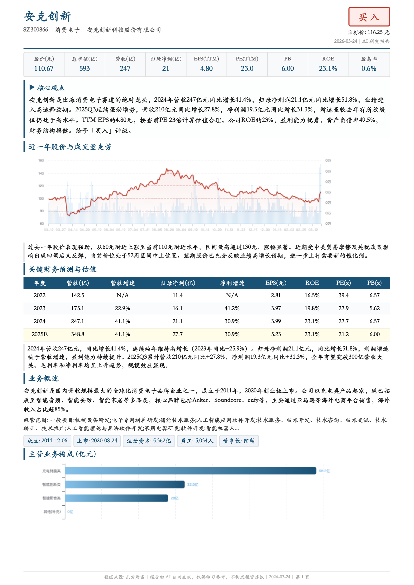
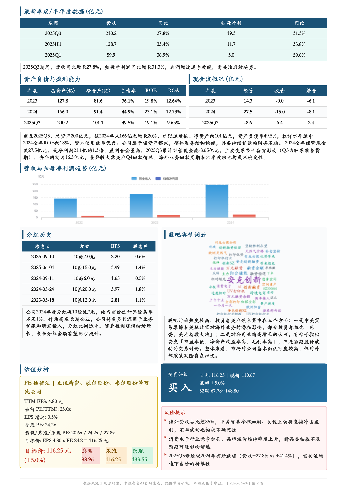
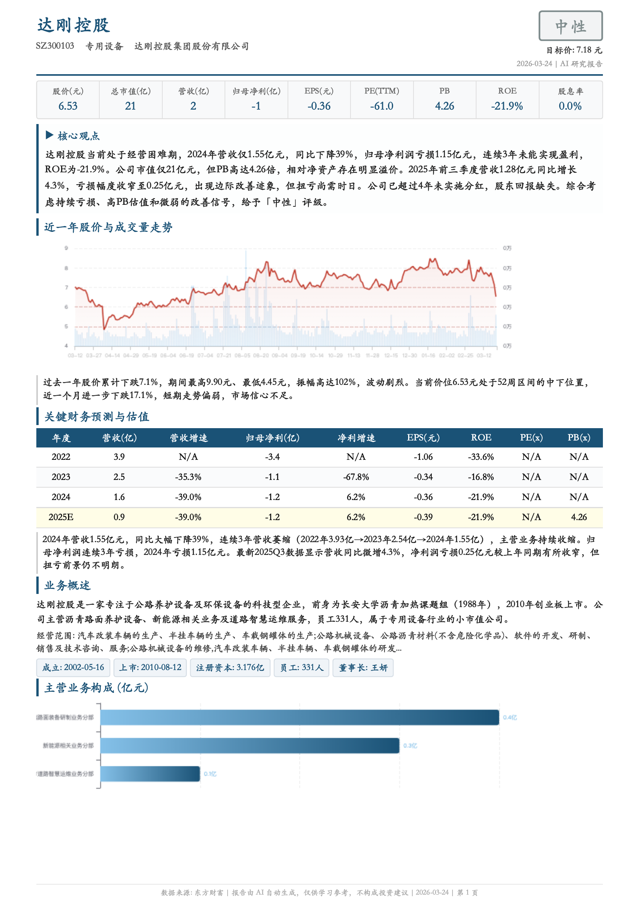
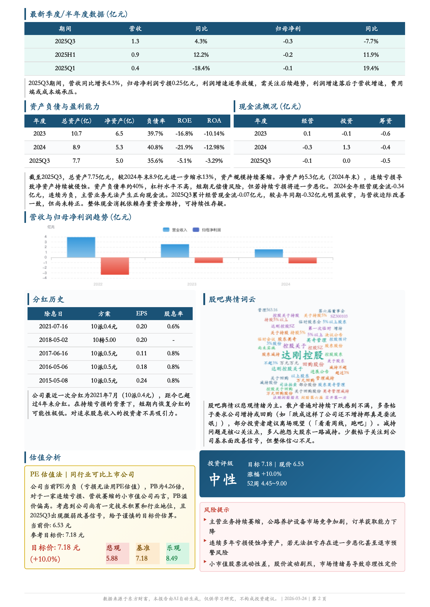

# Finance Report Skill

A Claude Code skill that generates professional A-share (A股) equity research reports. Give it a stock code, get a 2-page PDF research report with data-driven analysis.

## Sample Output

**安克创新 (300866) — 买入**

<p>
  
  
</p>

**达刚控股 (300103) — 中性**

<p>
  
  
</p>

## Design Philosophy

### Three-Stage Pipeline

```
用户输入股票代码 → fetch_data.py 抓取数据 → Claude 分析写 analysis.json → generate_report.py 渲染 PDF
```

**为什么这样设计？** 把"确定性工作"和"需要判断的工作"分开：
- **数据抓取**（确定性）→ Python 脚本，可重复、可缓存
- **投资分析**（需要判断）→ Claude 读原始数据后写分析，发挥 LLM 的推理能力
- **PDF 渲染**（确定性）→ Python 脚本，HTML + ECharts 图表 → Playwright 转 PDF

### Data Freshness: Annual + Quarterly

财务数据不是只用年报或只用季报，而是**各取所长**：

| 数据类型 | 用什么 | 为什么 |
|---------|-------|-------|
| 资产负债表 | **最新一期**（不管年/季） | 时点数据，越新越准 |
| 利润表 | **季度同比**讲边际 + **年度**讲趋势 | 投资者最关心"加速还是减速" |
| 现金流表 | **年度为主** + 季度参考 | 季报是累计值且季节性强 |
| 估值 | **TTM EPS**（滚动12个月） | 既反映最新盈利能力，又消除季节性 |

### Valuation with TTM EPS

估值计算使用 TTM (Trailing Twelve Months) EPS 而非静态年报 EPS：

```
TTM净利润 = 最近年报 + 最新季报累计 - 去年同期累计
例：2025Q3 → TTM = 2024年报 + 2025Q3 - 2024Q3
```

### Report Content (2 Pages)

**Page 1**: 评级+目标价 → 核心指标 → 核心观点 → K线走势图 → 财务预测表 → 业务概述 → 主营构成

**Page 2**: 最新季报数据 → 资产负债+现金流(2年+最新季度) → 营收利润图 → 分红+股吧词云 → 估值分析+评级+风险

## Installation

### Prerequisites

- Python 3.10+
- [Claude Code](https://docs.anthropic.com/en/docs/claude-code) CLI

### Setup

```bash
# 1. Clone
git clone git@github.com:OwenLittleWhite/finance-report.git

# 2. Install Python dependencies
pip install -r finance-report-skill/scripts/requirements.txt

# 3. Install jieba (Chinese word segmentation for word cloud)
pip install jieba

# 4. Install Playwright browser
playwright install chromium

# 5. Install the skill to Claude Code
#    Add the skill path to your Claude Code settings,
#    or place it in ~/.claude/skills/finance-report-skill/
```

### Verify Installation

```bash
# Test data fetching (e.g., 贵州茅台)
python finance-report-skill/scripts/fetch_data.py 600519 ./600519

# Test report generation (after creating analysis.json)
python finance-report-skill/scripts/generate_report.py ./600519
```

## Usage

### With Claude Code (Recommended)

Just tell Claude a stock code:

```
> 帮我分析一下 300866
> 给 601318 出个研报
> 分析下贵州茅台
```

Claude will automatically:
1. Fetch latest data from East Money
2. Read and analyze all financial data
3. Write `analysis.json` with investment thesis
4. Generate the PDF report
5. Review the output and fix issues

### Manual (Without Claude Code)

```bash
# Step 1: Fetch data
python finance-report-skill/scripts/fetch_data.py 300866 ./300866

# Step 2: Write analysis.json manually (see SKILL.md for schema)

# Step 3: Generate report
python finance-report-skill/scripts/generate_report.py ./300866
```

## Project Structure

```
finance-report/
├── finance-report-skill/
│   ├── SKILL.md              # Skill definition (triggers + instructions)
│   ├── scripts/
│   │   ├── fetch_data.py     # Data fetching from East Money APIs
│   │   ├── generate_report.py # HTML/PDF report generation
│   │   └── requirements.txt
│   ├── references/
│   │   ├── api_reference.md  # East Money API docs
│   │   └── valuation_guide.md # Valuation methodology
│   └── assets/
├── examples/                  # Sample report screenshots
└── README.md
```

### Key Files

- **`SKILL.md`** — The skill definition file. Contains the full workflow, analysis guidelines, data freshness principles, and rating methodology. This is what Claude reads when the skill triggers.
- **`fetch_data.py`** — Fetches 10+ types of data from East Money public APIs. No authentication needed. Outputs JSON files to the stock directory.
- **`generate_report.py`** — The report renderer (~3000 lines). Reads `analysis.json` + raw data → generates HTML with ECharts charts → converts to PDF via Playwright. Handles valuation calculation, TTM EPS, price fallback, and all layout logic.

## Data Sources

All data comes from [East Money (东方财富)](https://www.eastmoney.com/) public APIs:

| Data | Source | Auth |
|------|--------|------|
| Real-time quote | Push2 API | None |
| Financial statements | Datacenter API | None |
| Company profile | CompanySurveyAjax | None |
| Dividends | Datacenter API | None |
| K-line | Push2 Kline API | None |
| Forum posts | GuBa API | None |

## Limitations

- A-share (沪深) stocks only
- Data depends on East Money API availability
- PDF rendering requires Playwright + Chromium
- Price data may show previous close during non-trading hours (handled with fallback)
- Report is in Chinese only

## License

MIT
